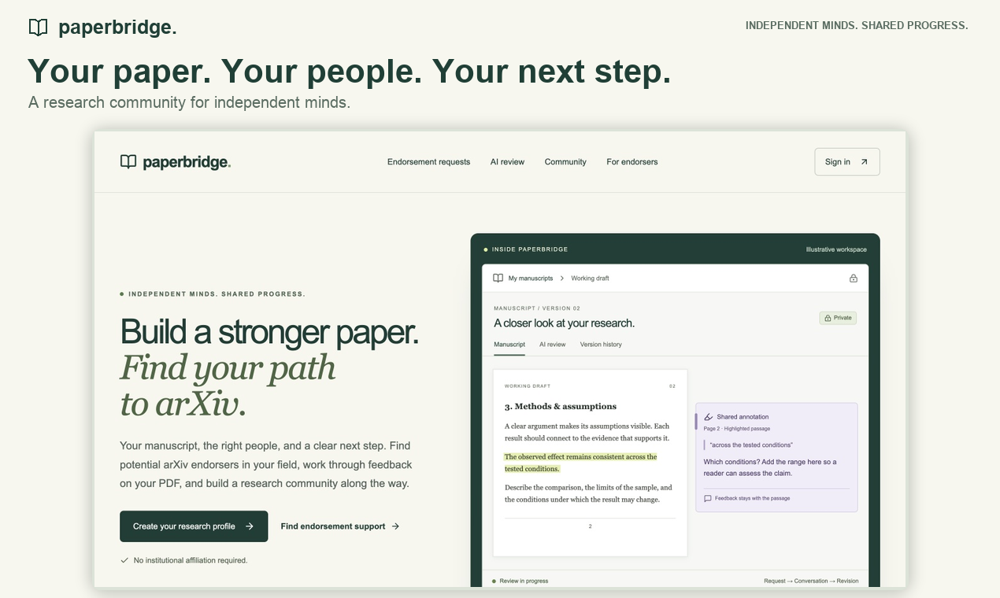
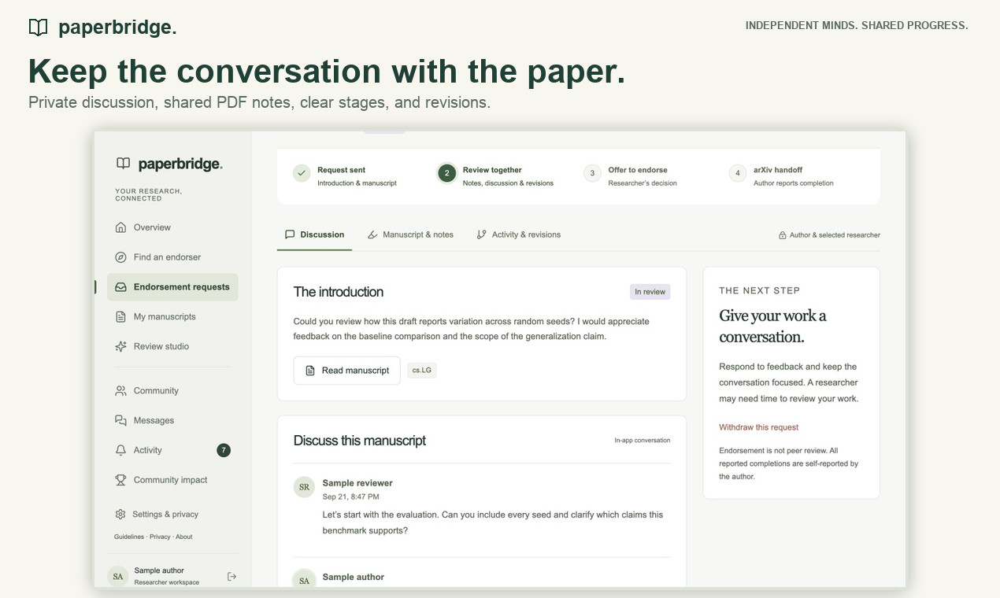
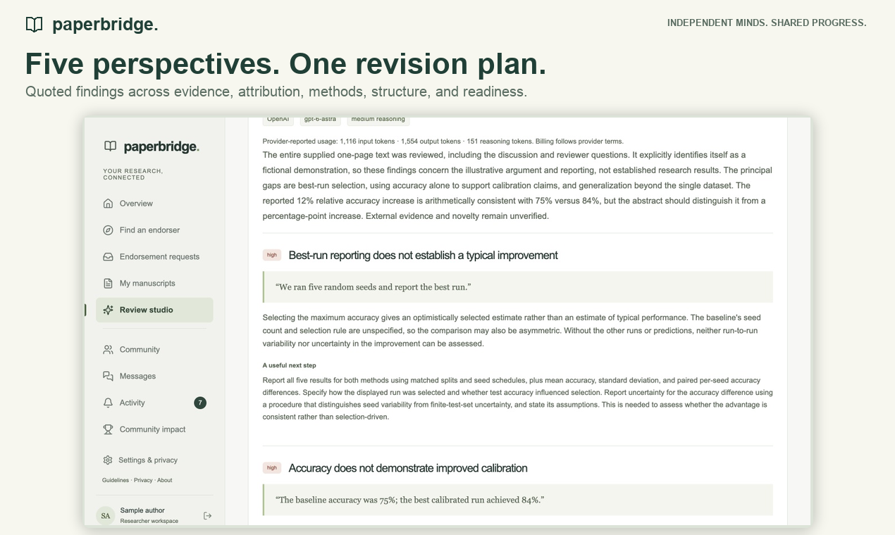
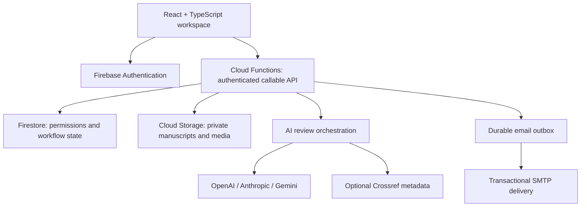

<div align="center">

# PaperBridge

### Independent minds. Shared progress.

A research workspace that connects people, private manuscripts and specialist AI feedback.

[**Try PaperBridge**](https://paperbridge.web.app/) · [**Watch the demo**](https://www.youtube.com/watch?v=ayknhfM37LQ) · [**Explore the architecture**](#architecture) · [**Run locally**](#run-locally)

[](https://github.com/shi1720/PaperBridge/actions/workflows/ci.yml)



</div>

## Research should not stop at the edge of your network

Finding someone qualified to discuss a paper is difficult without an established academic network. Finding that person is only the first step: the manuscript, the conversation, the feedback and the next revision still need somewhere to come together.

PaperBridge connects that journey. Discover potential collaborators and arXiv endorsers, work through a draft in a private workspace, and use optional AI review to identify questions worth investigating before the next revision.

Built by [Shivam Gupta](https://shivamgupta.web.app/), from product design through implementation, testing and deployment. The live application and source are publicly accessible. The screenshots and walkthrough use sample manuscripts and demo accounts.

## What you can do

| Workflow                     | What is implemented                                                                                                                                               |
| ---------------------------- | ----------------------------------------------------------------------------------------------------------------------------------------------------------------- |
| **Find the right people**    | Researcher and endorser profiles, 155 arXiv categories, research interests, availability, capacity and self-reported eligibility.                                 |
| **Collaborate privately**    | Endorsement requests, explicit review stages, discussion, immutable PDF revisions and request activity. Duplicate and capacity checks run atomically.             |
| **Keep feedback in context** | A searchable PDF reader, highlights, private or shared notes, threaded replies and resolution, with annotations attached to a manuscript version.                 |
| **Review a draft with AI**   | Five configurable specialists examine evidence, attribution, methods, formatting and submission readiness. A synthesis step produces a prioritized revision plan. |
| **Build a research network** | Image and PDF posts, reading lists, following, comments, private chat, an activity inbox, blocking and reporting.                                                 |
| **Stay in control**          | Explicit AI consent, encrypted provider keys, account export, key removal and account deletion with retryable cleanup.                                            |

The core workspace is free. Optional AI review uses the researcher's own OpenAI, Anthropic or Gemini account and provider billing. Review coverage, supporting quotations and partial results remain visible.

### A shared manuscript workspace



### Several perspectives, one revision plan



**Research boundaries:** PaperBridge is independent of arXiv. It does not grant endorsement, verify current arXiv privileges, certify peer review or promise publication. Endorsement takes place on arXiv itself. AI review supports human judgment; attribution feedback is not a comprehensive plagiarism scan.

## Architecture



- **Frontend:** React, TypeScript, Vite, React Router, Radix UI and PDF.js.
- **Backend:** Firebase Authentication, Cloud Functions, Firestore, Cloud Storage and Firebase Hosting.
- **Access control:** The callable API enforces permissions. Direct client database access is denied. Shared notes are scoped to the relevant collaboration; private notes remain restricted to their author.
- **Manuscript access:** Signed PDF links expire after ten minutes. Withdrawing a request prevents new reviewer links. Previously issued links remain valid until expiry, and downloaded copies cannot be recalled.
- **AI:** Encrypted per-user keys, separate provider adapters, structured findings, quotation validation, extraction-coverage diagnostics, usage limits and retry IDs. Five specialists feed a final synthesis.
- **Operations:** Validated uploads, temporary media links, a retryable SMTP outbox, verification and recovery emails, and account cleanup. The production client and isolated backend use explicitly configured Firebase resources.

## Run locally

**Prerequisites:** Node.js 22. The backend emulator suite also needs Java 21.

```sh
git clone https://github.com/shi1720/PaperBridge.git
cd PaperBridge
npm ci
npm --prefix functions ci
npm run dev
```

Open **http://localhost:5173/?demo=1**. This labeled development demo uses fictional profiles and an in-memory PDF fixture. No provider key is required. Refreshing resets the demo. These fixtures are excluded from production.

### Use the Firebase backend locally

Start the emulators:

```sh
npm --prefix functions run build
node scripts/prepare-emulator.cjs
npx firebase emulators:start --only auth,firestore,storage,functions --project demo-paperbridge
```

In a second terminal, start the frontend against those emulators:

```sh
VITE_FIREBASE_AUTH_TENANT_ID= \
VITE_USE_EMULATORS=true \
VITE_FIREBASE_PROJECT_ID=demo-paperbridge \
VITE_FIREBASE_STORAGE_BUCKET=demo-paperbridge.appspot.com \
VITE_FIREBASE_API_KEY=emulator-key \
npm run dev
```

Emulated verification emails appear in emulator output/UI. Tests verify addresses through the Auth emulator only; production has no verification bypass. Real accounts use Firebase storage, not browser storage.

## Verification

```sh
# Unit tests, backend checks and production build
npm run check

# Emulator integration tests and browser journeys
npx playwright install --with-deps chromium webkit
npm run test:full

# Runtime dependency audits
npm audit --omit=dev
npm --prefix functions audit --omit=dev
```

CI runs the integration suite in Chromium and responsive journeys in WebKit. Coverage includes two-account sign-up, verified role setup, PDF upload/rendering, category matching, review requests, feedback, withdrawal, loss of reviewer access, mobile layouts and accessibility checks.

`test:full` starts an isolated Firebase suite and two Vite servers. Stop earlier emulator sessions to avoid port conflicts. Integration tests reset the **demo-paperbridge emulator database**; do not keep work you need in that emulator while testing.

Provider calls are mocked in the automated suite. Separate live checks exercised OpenAI review, browser-to-callable encrypted-key handling, manuscript flows and real email delivery. Anthropic and Gemini have adapter tests; their live integrations have not been verified with supplied credentials. See the [validation record](docs/validation.md) for evidence and limits.

## Documentation

| Guide                                               | Contents                                                             |
| --------------------------------------------------- | -------------------------------------------------------------------- |
| [Deployment](docs/deployment.md)                    | Firebase resources, secrets, rollout and verification                |
| [API contract](docs/contract.md)                    | Operations and authorization boundaries                              |
| [Backend operations](docs/backend.md)               | Storage, functions, email and cleanup                                |
| [AI design](docs/ai.md)                             | Specialist orchestration, grounding and verification                 |
| [Validation record](docs/validation.md)             | Automated and live checks                                            |
| [Experience audit](docs/experience-improvements.md) | Usability findings and fixes                                         |
| [Product study](docs/product-review.md)             | Simulated research, explicitly distinguished from real user evidence |

## Deployment and current limits

The checked-in deployment configuration targets the existing PaperBridge infrastructure. **For your own deployment, configure your own Firebase projects and resources first** using the [deployment guide](docs/deployment.md).

Provider keys must never appear in browser bundles or committed environment files. Firebase web configuration is public application configuration; encryption and SMTP credentials belong in Secret Manager. Enable production account flows and Google sign-in only after their required services and OAuth domains have been configured and verified.

Current limits are explicit:

- No paid subscription checkout, OCR or full-text plagiarism corpus.
- Moderation reports need an operator. Some histories return bounded recent records without older-message pagination.
- AI review is a bounded synchronous six-stage pipeline with saved partial results, rather than a durable background queue.
- Billing alerts, App Check enforcement, monitoring and a staffed support process remain operator setup work.
- Early product research was simulated. Observing real researchers and reviewers is the next validation step.

For a bug or improvement, open an issue with a reproducible example. Report security concerns privately using [SECURITY.md](SECURITY.md).
